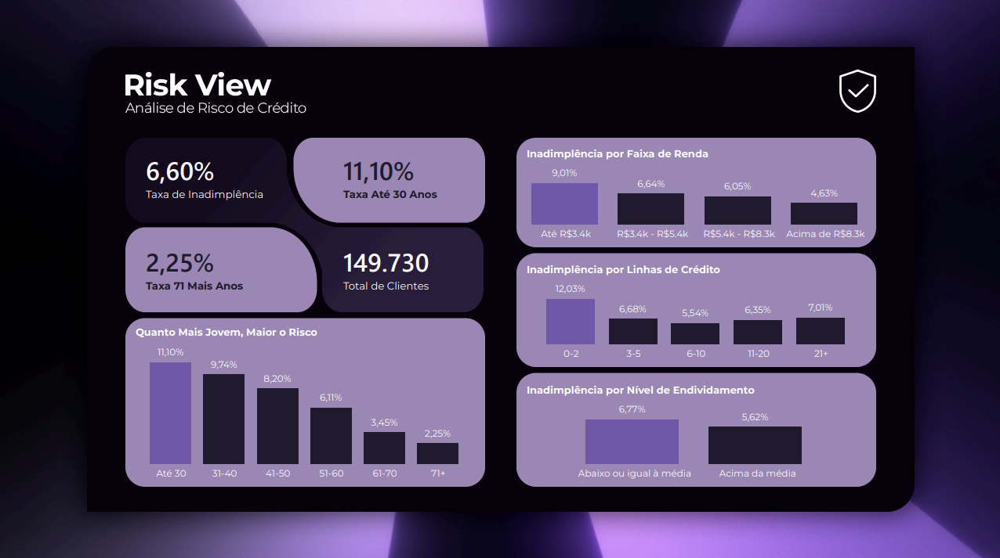

# RiskView: Análise de Risco de Crédito

Projeto de análise de dados aplicado a risco de crédito, com o objetivo de identificar quais fatores mais se relacionam com a inadimplência de clientes. Desenvolvido com Python, SQL e Power BI, usando um dataset público do Kaggle.

## Dashboard

Link interativo: [dashboard publicado no Power BI](https://app.powerbi.com/view?r=eyJrIjoiNGQ5ZWMzZWQtMDYxNi00MTllLWI2N2QtNTlmZWNmYWQxYzFjIiwidCI6Ijc5ZTBjMDNmLWVkNDQtNDMwOS04M2M5LTM4YTY1ZTI4NzlmMiJ9)

## Dataset

"Give Me Some Credit" (Kaggle), com dados de aproximadamente 150 mil clientes, incluindo idade, renda, número de linhas de crédito, histórico de atraso de pagamento e se o cliente ficou inadimplente em um período de 2 anos.

## Limpeza de dados

- Remoção de 1 linha com idade inválida (0 anos)
- Remoção de 269 linhas com códigos de erro nas colunas de atraso de pagamento
- Imputação de renda mensal ausente (29.731 linhas, cerca de 20% da base) com a mediana
- Imputação de número de dependentes ausente com 0
- Tratamento de outliers extremos (winsorização no percentil 95) nas colunas de utilização de crédito e endividamento

Base final: 149.730 linhas, sem valores nulos.

## Principais insights

1. **Idade é o fator mais forte de risco**: a taxa de inadimplência cai de 11,10% (até 30 anos) para 2,25% (acima de 71 anos), quase 5 vezes de diferença.
2. **Renda mais baixa está associada a maior inadimplência**: de 9,01% na faixa mais baixa para 4,63% na mais alta.
3. **Número de linhas de crédito segue um padrão em U, não linear**: tanto poucas (0-2) quanto muitas (21+) linhas de crédito representam mais risco que uma quantidade moderada (6-10).
4. **Nível de endividamento (DebtRatio) é um preditor fraco isoladamente**: confirmado tanto por correlação quanto por uma consulta SQL, o histórico de atraso de pagamento é um preditor bem mais forte.

## Ferramentas e técnicas usadas

- **Python** (pandas, matplotlib, seaborn): limpeza de dados e análise exploratória
- **SQL** (SQLite): consultas com CTE, window function e subquery
- **Power BI**: dashboard interativo, DAX, Power Query

## Notebook completo

[Notebook no Kaggle](https://www.kaggle.com/code/mcontee/notebook7c4f06fdeb) com todo o passo a passo da análise (limpeza, exploração e consultas SQL).

## Autor

Mateus Conte Feitosa
[LinkedIn](https://linkedin.com/in/mateus-conte) | mateusconte_13@hotmail.com
